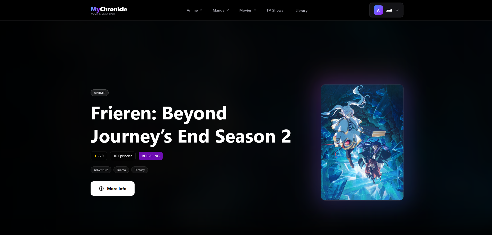
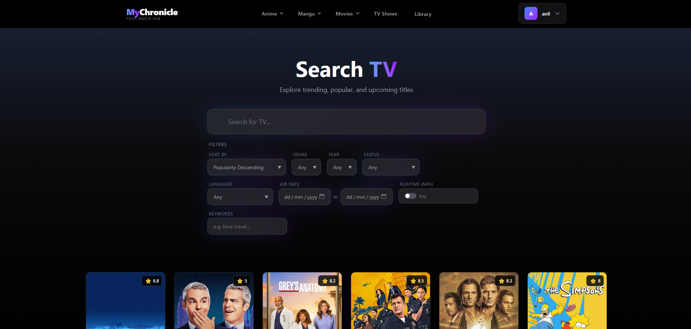
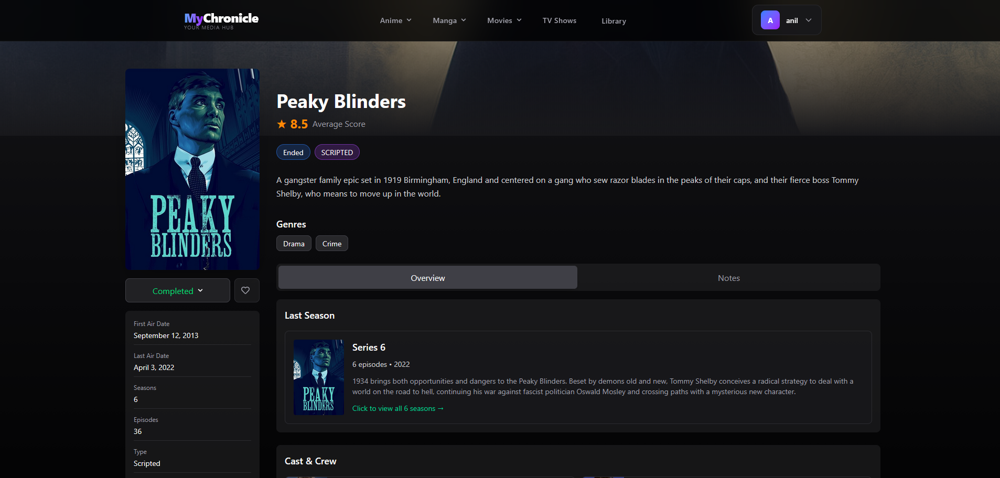
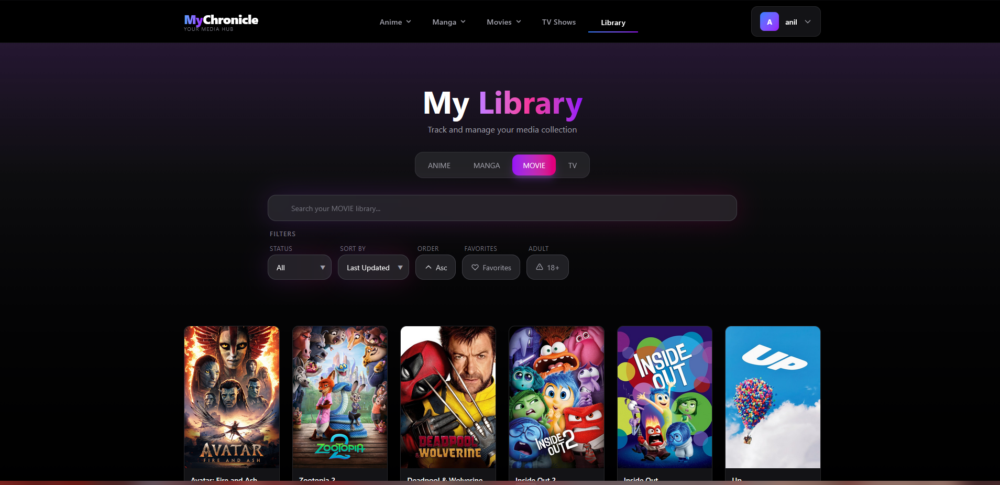

# MyChronicle — Frontend

Frontend for **MyChronicle**, a media tracking application for anime, movies, and TV shows.

The application allows users to search, discover, and manage their media library through the MyChronicle backend API.

⚠️ This project is primarily intended for personal use due to rate limits on AniList and TMDB APIs.  
Some features may not work under heavy public usage.

## Live Deployment

https://linazze.com

## Screenshots

### Home Page


### Media Search


### Media Detail Page


### User Library


## Backend Repository

Backend API for this project:  
https://github.com/dmrk8/MyChronicle-backend

## Features

- Search anime, movies, and TV shows
- Browse seasonal anime and featured media
- Add media to a personal library and track status & progress
- Write and manage notes and reviews
- User registration, login, and profile management
- Protected routes with JWT-based authentication
- Responsive UI

## Tech Stack

| Layer | Technology |
|---|---|
| Framework | React 19 |
| Language | TypeScript 5.9 |
| Build Tool | Vite |
| Styling | Tailwind CSS v4 |
| State / Fetching | TanStack Query v5 |
| Routing | React Router v7 |
| HTTP Client | Axios |

## External API Integrations

| API | Purpose |
|---|---|
| [AniList](https://anilist.gitbook.io/anilist-apiv2-docs/) | Anime & Manga |
| [TMDB](https://developer.themoviedb.org/docs) | Movies & TV shows |


## Architecture

```
Browser
   │
   ▼
React App (Vite)
   │
   ├── React Router (client-side routing)
   ├── TanStack Query (server state & caching)
   ├── AuthContext (session state)
   └── MyChronicle Backend API
```


## Pages & Routes

| Route | Description | Auth Required |
|---|---|---|
| `/home` | Home page with featured media | No |
| `/:mediaType/search` | Search anime, movies, or TV shows | No |
| `/:mediaType/:id` | Media detail page | No |
| `/library` | Personal media library | Yes |
| `/profile` | User profile & settings | Yes |
| `/login` | Login page | No |
| `/signup` | Registration page | No |

## Project Structure

```
src/
├── api/         # Axios API clients (auth, users, media, reviews)
├── components/  # Shared UI components
├── constants/   # Filter and media type constants
├── contexts/    # Auth context definition
├── hooks/       # Custom React hooks
├── pages/       # Page components
├── providers/   # Context providers
├── routes/      # Route definitions
├── types/       # TypeScript interfaces
└── utils/       # Utility helpers
```


## Environment Variables

Create a `.env.development` file in the project root:

```env
VITE_API_URL=http://localhost:8000
```

## Installation & Running Locally

```bash
# Clone the repo
git clone https://github.com/dmrk8/MyChronicle-frontend.git
cd MyChronicle-frontend

# Install dependencies
npm install

# Create your .env.development file
VITE_API_URL=http://localhost:8000

# Start development server
npm run dev
```

The app will be available at:

```
http://localhost:5173
```

## Available Scripts

| Script | Description |
|---|---|
| `npm run dev` | Start development server |
| `npm run build` | Type-check and build for production |
| `npm run preview` | Preview production build locally |
| `npm run lint` | Run ESLint |

License
This project is licensed under the MIT License.